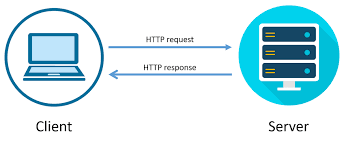

## <span style="color:#ABF200">브라우저에 www.naver.com  을 쓰고 Enter 클릭시 어떤일이 일어날까?</span>
<br>

```
1. 브라우저에 www.naver.com을 입력한다.
2. DNS(Domain Name Service) 를 통해 IP(Internet Protocol)주소를 획득한다.
3. 획득한 IP 주소에 있는 서버와 TCP 3 Way Handshake를 진행한다.
4. 통신을 맺은 서버에 HTTP Request를 한다.
5. 서버에서 보낸 HTTP Response를 통해 html 파일을 가져온다.
6. 크롬,웨일등 브라우저가 html을 해석해서 출력한다.
```

일반적으로는 html파일을 가져오게되고 경우에 따라서 REST API 호출시 JSON, XML 도 호출하게 된다.


<br>

# 용어설명

## DNS 란 무엇인가?
    - 도메인 이름(www.naver.com) - > IP주소(17.929.255.xxx)로 변환


## DNS 캐시
- DNS에서 이미 한번 처리된 도메인 네임과 IP주소를 캐시에 유지하게 해서 속도를 올려줌
- 매번 DNS와 통신을 하는 비용을 줄이기 위한 수단, 주소를 저장
- 저장 위치
  - 브라우저
  - 운영체제
  - 라우터
  - ISP(Internet Service Provider)

<br>

## TCP 3 Way Handshake  

### TCP ( Transmission Control Protocol)

<br>

example
```
1. 전화를 걸고 친구가 받기를 기다린다 : SYN
2. 친구가 전화를 받고 "여보세요" : ACK + SYN
3. 전화 통화한다. "안녕하세요", 누구누구입니다 : ACK
```

## HTTP request, response (Hyper text Transfer Protocol)
 - HTTP(Hyper Text Transfer Protocol): WWW 상에서 정보를 주고받을 수 있는 프로토콜

 - 요청와 응답으로 서버는 클라이언트와 통신하는 구조



## TCP 와 UDP의 차이점
```
TCP는 데이터를 주고 받을 양단 간에 먼저 연결을 설정하고 설정된 연결을 통해 양방향으로 데이터를 전송하지만, UDP는 연결을 설정하지 않고 수신자가 데이터를 받을 준비를 확인하는 단계를 거치지 않고 단방향으로 정보를 전송한다.

신뢰성 -TCP는 메시지 수신을 확인하지만 UDP는 수신자가 메시지를 수신했는지 확인할 수 없다.

UDP는 순서를 예측할 수 없다.
부하 - TCP보다 속도가 일반적으로 빠르고 오버헤드가 적다
```

## ISP
```
신뢰성 있는 연결 지향형 프로토콜로 연속적으로 패킷의 상태 정보를 확인하고 유지한다.

오류제어, 흐름제어, 혼잡제어 등을 제공한다.

SYN : synchronize sequence number
ACK : acnowledgement
```
